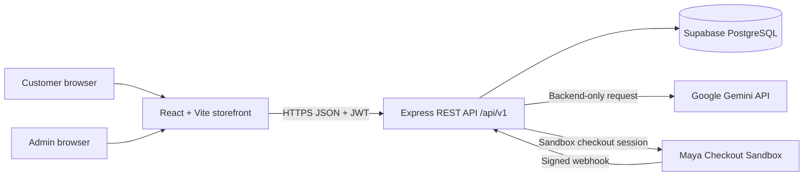
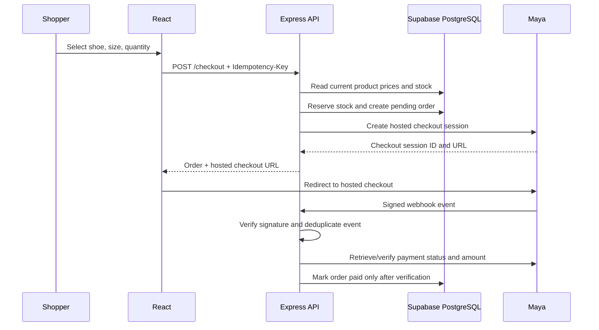

# SOLEVA system architecture

```mermaid
flowchart LR
  C[Customer browser] --> R[React + Vite storefront]
  A[Admin browser] --> R
  R -->|HTTPS JSON + JWT| API[Express REST API /api/v1]
  API --> DB[(Supabase PostgreSQL)]
  API -->|Backend-only request| AI[Google Gemini API]
  API -->|Sandbox checkout session| PM[Maya Checkout Sandbox]
  PM -->|Signed webhook| API
```

```mermaid
sequenceDiagram
  participant Shopper
  participant React
  participant API as Express API
  participant DB as Supabase PostgreSQL
  participant Maya
  Shopper->>React: Select shoe, size, quantity
  React->>API: POST /checkout + Idempotency-Key
  API->>DB: Read current product prices and stock
  API->>DB: Reserve stock and create pending order
  API->>Maya: Create hosted checkout session
  Maya-->>API: Checkout session ID and URL
  API-->>React: Order + hosted checkout URL
  React->>Maya: Redirect to hosted checkout
  Maya->>API: Signed webhook event
  API->>API: Verify signature and deduplicate event
  API->>Maya: Retrieve/verify payment status and amount
  API->>DB: Mark order paid only after verification
```
